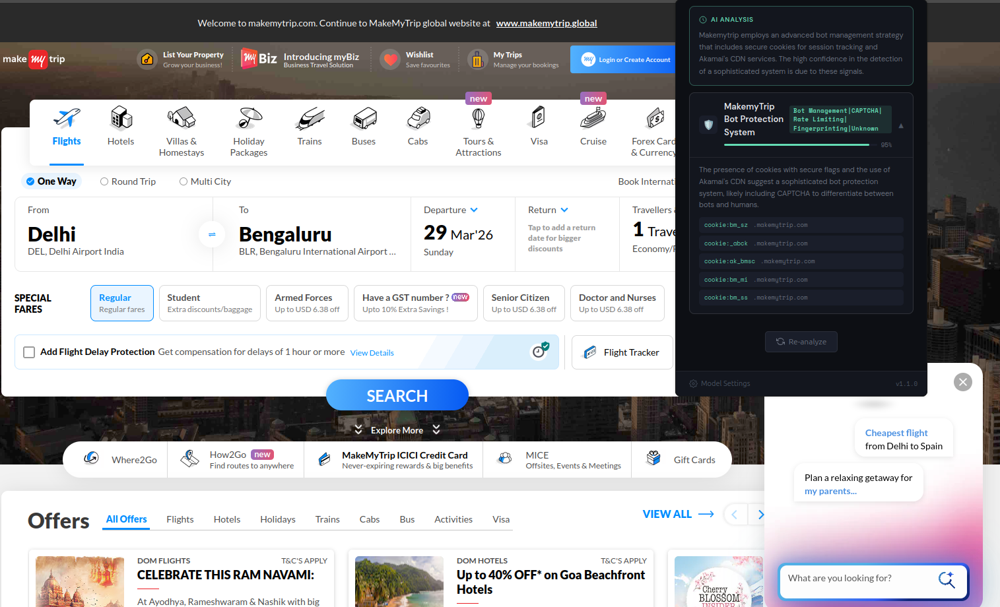

# 🛡️ Bot Shield Detector

A Firefox extension that uses AI to detect bot protection systems on any webpage — analyzing HTTP headers, cookies, and page-level signals to identify services like Cloudflare, Akamai, DataDome, PerimeterX, Google reCAPTCHA, and Imperva Incapsula.

---

## Features

- **Multi-provider AI analysis** — choose from Gemini (cloud), Ollama, HuggingFace TGI, or a local Flask service
- **Detects 6 major bot protection systems** out of the box:
  - 🟠 Cloudflare (Bot Management, Turnstile, WAF)
  - 🔵 Akamai Bot Manager
  - 🟣 DataDome
  - 🟡 PerimeterX / HUMAN Security
  - 🟢 Google reCAPTCHA
  - 🔴 Imperva Incapsula
- **Signal-level transparency** — see exactly which headers, cookies, scripts, and global variables triggered each detection
- **Confidence scoring** — each detection comes with a 0–100% confidence bar
- **Overall risk rating** — NONE / LOW / MEDIUM / HIGH badge per page
- **AI-written summary** — a plain-English explanation of what was found and why
- **Re-scan on demand** — re-analyze at any time without reloading the page

---

## Screenshots

> 

---

## Installation (Firefox)

### From source (Developer / Temporary install)

1. Clone or download this repository:
   ```bash
   git clone https://github.com/YOUR_USERNAME/bot-shield-detector.git
   cd bot-shield-detector
   ```

2. Open Firefox and navigate to:
   ```
   about:debugging#/runtime/this-firefox
   ```

3. Click **"Load Temporary Add-on…"**

4. Select the `manifest.json` file from the project folder.

The extension icon will appear in your toolbar immediately. Note: temporary installs are removed when Firefox closes.

### Permanent install (self-signed)

To keep the extension across restarts, you need to sign it via [Mozilla Add-on Developer Hub](https://addons.mozilla.org/developers/) or use `web-ext` to build and sign it:

```bash
npm install -g web-ext
web-ext sign --api-key=YOUR_KEY --api-secret=YOUR_SECRET
```

---

## Setup & Configuration

When you click the extension icon for the first time, you'll be prompted to choose an AI provider.

### Option 1 — Gemini 2.0 Flash (recommended, free tier available)

1. Get a free API key at [aistudio.google.com](https://aistudio.google.com)
2. Select **Gemini 2.0 Flash** in the setup screen
3. Paste your `AIza...` key and click **Save**

No local software needed.

---

### Option 2 — Ollama (fully local, no API key)

1. Install Ollama: [ollama.com](https://ollama.com)
2. Pull a model:
   ```bash
   ollama pull mistral
   # or: ollama pull llama3.2 / phi3 / gemma2 / qwen2.5
   ```
3. Start Ollama with cross-origin access enabled (required for browser extensions):
   ```bash
   # macOS / Linux
   OLLAMA_ORIGINS="*" ollama serve

   # Windows (PowerShell)
   $env:OLLAMA_ORIGINS="*"; ollama serve
   ```
4. In the extension, select **Ollama**, set the URL to `http://localhost:11434`, pick your model, and click **Save**.

---

### Option 3 — HuggingFace TGI (local or cloud)

1. Run a TGI server locally or use a HuggingFace Inference Endpoint
2. Select **HuggingFace TGI** in setup
3. Set the endpoint URL (default: `http://localhost:8080`)
4. Optionally paste your `hf_...` token for authenticated endpoints
5. Select or type a model name and click **Save**

Supported preset models: Mistral 7B, Llama 3.2 3B, Phi-3 Mini, Zephyr 7B.

---

### Option 4 — Flask Service (custom backend)

If you have a local Python Flask backend that wraps any LLM:

1. Start your Flask app:
   ```bash
   cd bot-shield-flask/
   python app.py
   ```
2. Select **Flask Service** in setup
3. Set the URL to `http://localhost:5000` (or your custom port) and click **Save**

The extension expects your server to expose:
- `GET /health` → `{ "provider": "...", "model": "..." }`
- `POST /analyze` → returns a detection result JSON

---

## How It Works

```
Page load
  └─ background.js captures HTTP request/response headers via webRequest API
  └─ content.js collects cookies, script tags, and global JS variables from the page

Popup open → "Analyze Page" clicked
  └─ Fetches captured header data from background.js
  └─ Fetches content signals from content.js via runtime messaging
  └─ Runs local heuristic pre-scan against known signatures
  └─ Sends all signals to the selected AI model
  └─ Parses structured JSON response (detections + summary + risk)
  └─ Renders expandable detection cards with signal details
```

The AI model receives a structured prompt containing all collected signals and is asked to return a JSON object in the format:

```json
{
  "detections": [
    {
      "id": "cloudflare",
      "name": "Cloudflare",
      "type": "WAF / BOT MGMT",
      "confidence": 95,
      "notes": "Strong Cloudflare presence via cf-ray header and __cf_bm cookie.",
      "signals": [
        { "key": "header: cf-ray", "val": "abc123-AMS" },
        { "key": "cookie: __cf_bm", "val": "..." }
      ]
    }
  ],
  "summary": "This site is protected by Cloudflare's Bot Management...",
  "overallRisk": "high"
}
```

---

## Detected Signals

| Signal Type | Examples |
|---|---|
| Response headers | `cf-ray`, `x-akamai-request-id`, `x-datadome-request`, `x-iinfo` |
| Request headers | `user-agent`, `accept-language` |
| Cookies | `__cf_bm`, `_abck`, `datadome`, `_px`, `_grecaptcha`, `incap_ses` |
| Script URLs | `challenges.cloudflare.com`, `tags.datadome.co`, `client.px-cloud.net` |
| Global JS vars | `bmak`, `DataDome`, `_pxAppId`, `grecaptcha`, `_cf_chl_opt` |

---

## Project Structure

```
bot-shield-detector/
├── manifest.json        # Extension manifest (Manifest V2, Firefox)
├── background.js        # WebRequest listener — captures headers per tab
├── content.js           # Page-level signal collector (cookies, scripts, globals)
├── popup.html           # Extension popup UI
├── popup.js             # Popup logic, AI provider routing, result rendering
├── popup.css            # Dark-themed UI styles
└── icons/
    └── icon_1.png
```

---

## Known Issues & Limitations

- **Temporary installs only** — Firefox requires a signed extension for permanent installs. Use `web-ext sign` or submit to AMO.
- **Ollama 403 errors** — Ollama blocks browser extension requests by default. You must start it with `OLLAMA_ORIGINS="*"`.
- **Headers captured on page load only** — navigating to a page _before_ the extension is installed will not have headers captured. Re-navigate to rescan.
- **content.js is listed as `web_accessible_resources`** — this is required for messaging but exposes the script URL. Acceptable for a developer tool; reconsider for a public distribution.
- **No Manifest V3 support** — uses MV2 `webRequest` (blocking) which is fully supported in Firefox but deprecated in Chrome. Chrome support is not a goal.

---

## Contributing

Pull requests are welcome. Some ideas for contributions:

- Add detection signatures for additional providers (Kasada, Shape Security, F5 BIG-IP, AWS WAF, Fastly)
- Add a Flask `app.py` reference implementation to the repo
- Add Claude / OpenAI / Mistral API provider options
- Improve the heuristic pre-scan to reduce AI calls for obvious cases
- Add an export button (copy JSON results to clipboard)


---
 
## Support
 
If this extension saved you time digging through DevTools, consider buying me a coffee — it helps fund more tools like this.
 
[](https://ko-fi.com/dimakynal)
 
---


---

## License

MIT — see [LICENSE](LICENSE) for details.

---

## Disclaimer

This tool is intended for **security research, development, and educational purposes**. Use it only on websites you own or have permission to analyze. Detection of bot protection systems does not imply any method of bypassing them.

